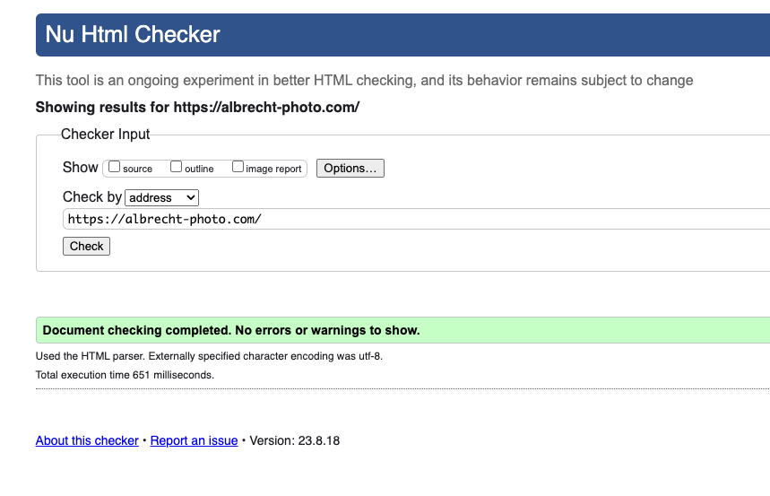
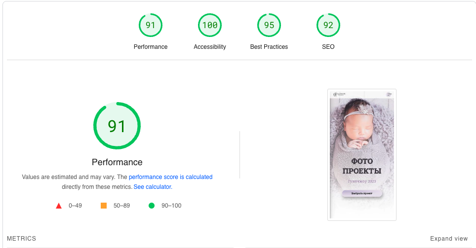

# Photo-projects-Guangzhou

Проект под заказ: Веб-сайт для фотографа в Гуанчжоу.

[Посмотреть можно здесь](https://albrecht-photo.com).

## Техническое задание: 

Основные требования:
* Cоздать мягкий, нежный дизайн, поскольку фотограф специализируется на съемке бемеренности, новорожденных и детей. 
* Сделать красивую нестандартную галлерею с модальными окнами.
* Сайт должен позволять клиентам ознакомиться с портфолио и работами фотографа, а также получить информацию о текущих/прошедших проектах.
* Сайт должен позволять клиентам просматривать свои фото с прошедших проектов, выбирать фото для ретуши, скачивать готовые, обработанные фотографии.

## Основные разделы:

* Главная страница
* О фотографе
* Галлерея
* Новый проект
* Прошедшие проекты
* Пакеты услуг
* Часто задаваемые вопросы
* Контакты

## Использованныe технологии:
* HTML
* CSS
* JS
* Wfolio

| Desktop | Mobile |
|-------------|-------------|
|||

## Результаты:
*  Через неделю после создания уже поступило 2 заявки от клиентов с сайта по проектам.
*  Стильный и нежный дизайн, которым доволен фотограф.
*  Адаптивность под все типы устройств (desktop и mobile)
*  Сайт проверен через онлайн валидаторы
*  Реализованы попапы для галлереи и прошедших проектов.
*  Сделано меню-бургер.
*  Сайт соответствует стандарту доступности.
*  Подобран домен и сайт размещен на хостинге.
*  Подключено облако для хранения и скачивания фотографии, настроен поддомен.
*  Установлены SSL-сертификаты.
  
| Accessibility| Validation HTML |Form validation |
|-------------|-------------|-------------|
||||

## Результаты скорости загрузки и оптимизации сайта:

